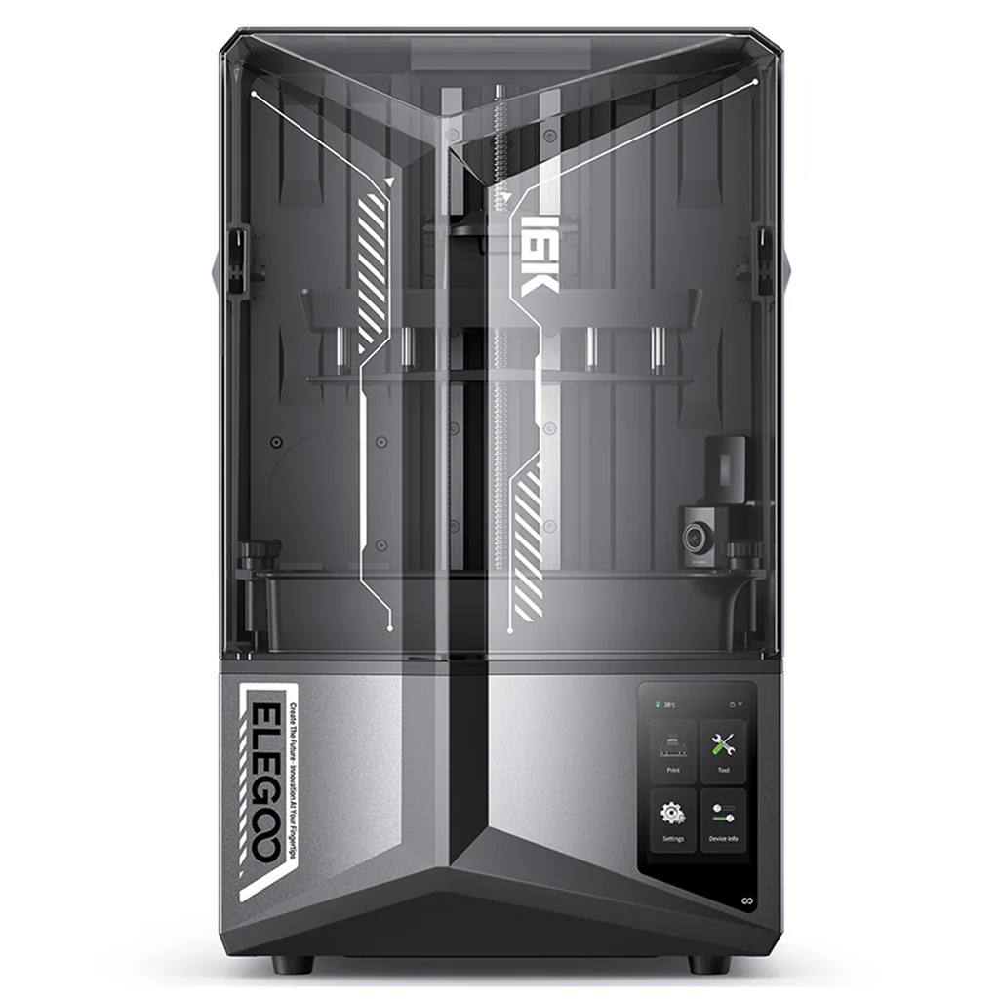

# Elegoo Saturn 4 Ultra – Lovelace Card

A Home Assistant Lovelace card that presents a clean, high‑contrast status panel for Elegoo resin printers (tested with the Saturn 4 Ultra). It auto‑discovers printers from the `elegoo_printer` integration and renders one **picture‑elements** panel per device, complete with live chamber camera, progress, layer info, UV LED temperature, error reason, and quick controls (pause/resume/stop).



## Features
- Works with multiple printers discovered from the `elegoo_printer` integration.
- Live camera tile (center) using `camera.<base>_chamber_camera`.
- Key stats: current status, percent complete, remaining time, current/total layers.
- UV LED temperature chip.
- Contextual controls: pause, resume (when paused), and stop.
- Shows current file name (strips path and extension).
- Highlights error reason when reported.
- Uses a background PNG for a polished look.

## Requirements
- **Home Assistant** with a working **Elegoo printer** integration exposing entities like:
  - `sensor.<base>_current_status` **or** `sensor.<base>_print_status` (anchor)
  - `sensor.<base>_percent_complete`
  - `sensor.<base>_remaining_print_time`
  - `sensor.<base>_current_layer`, `sensor.<base>_total_layers`
  - `sensor.<base>_file_name`, `sensor.<base>_error_status_reason`
  - `sensor.<base>_uv_led_temp`
  - `camera.<base>_chamber_camera`
  - `button.<base>_pause_print`, `button.<base>_resume_print`, `button.<base>_stop_print`
- Lovelace custom cards (install via HACS):
  - [`auto-entities`](https://github.com/thomasloven/lovelace-auto-entities)
  - [`layout-card`](https://github.com/thomasloven/lovelace-layout-card)
  - [`button-card`](https://github.com/custom-cards/button-card)

## Installation
1. Copy **assets/saturn_4_ultra.png** into your Home Assistant `/config/www/` folder.
   - After copying, it will be available in Lovelace as: `/local/saturn_4_ultra.png` (already referenced in the YAML).
2. Add the YAML from `lovelace/elegoo_saturn_ultra_card.yaml` to your dashboard:
   - *UI mode*: **Edit dashboard → Add card → Manual** and paste the YAML.
   - *YAML mode*: include the file or paste into your view’s cards list.
3. Confirm your Elegoo entities exist and follow the `<base>_…` pattern used above. The card auto‑generates one panel per device by detecting an “anchor” sensor ending in `_current_status` (or `_print_status` as a fallback).

## Customization
- Replace the background at `image: '/local/saturn_4_ultra.png'` if you prefer a different art style.
- Tweak element positions by editing the `style.top/left` percentages.
- If you want to show only a specific printer, wrap the card with `auto-entities` filters or fork the template to hard‑set `base` to the device you want.

## Troubleshooting
- **Card renders blank**: Usually means no anchor sensor was found. Ensure either `sensor.<base>_current_status` or `sensor.<base>_print_status` exists for your printer and the integration is loaded.
- **No background image**: Verify the file is at `/config/www/saturn_4_ultra.png` and the Lovelace path `/local/saturn_4_ultra.png` is correct. Clear browser cache/hard‑refresh.
- **Buttons do nothing**: Confirm you have the `button.*` entities and that your account has permission to call `button.press`.

## Example YAML
See [`lovelace/elegoo_saturn_ultra_card.yaml`](lovelace/elegoo_saturn_ultra_card.yaml) for the full, ready‑to‑paste configuration (the same content you see in this repository).

## Folder Structure
```
elegoo-saturn-ultra-card/
├─ assets/
│  └─ saturn_4_ultra.png
├─ lovelace/
│  └─ elegoo_saturn_ultra_card.yaml
├─ .gitignore
├─ LICENSE
└─ README.md
```

## License
MIT — see [`LICENSE`](LICENSE).

## Credits
Art and YAML template by the project author. Not affiliated with Elegoo.
