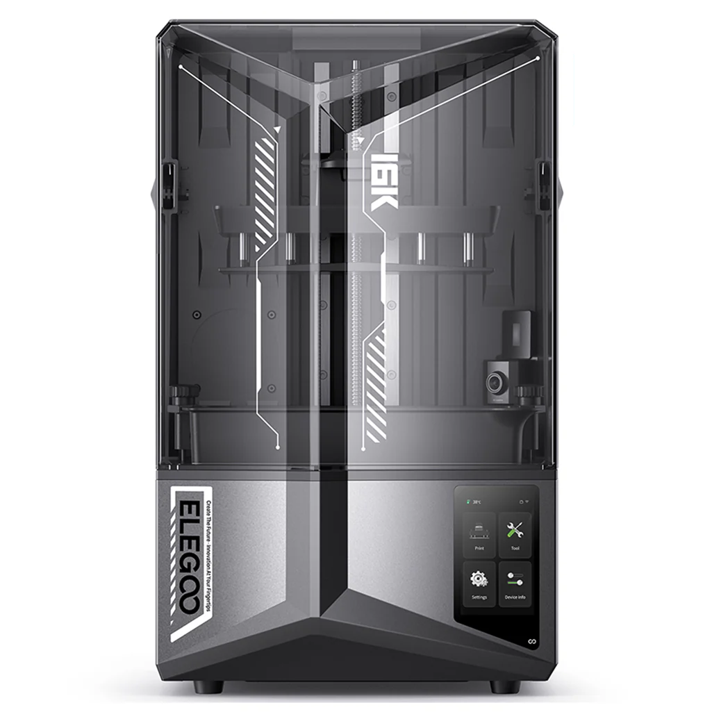

# Elegoo Saturn 4 Ultra – Lovelace Card

A Home Assistant Lovelace card that presents a clean, high-contrast status panel for Elegoo resin printers, tested with the Saturn 4 Ultra. It auto-discovers printers from the `elegoo_printer` integration and renders one `picture-elements` panel per device, complete with live chamber camera, progress, layer info, UV LED temperature, error reason, and quick controls.



## Features

- Works with multiple printers discovered from the `elegoo_printer` integration.
- Live camera tile using `camera.<base>_chamber_camera`.
- Key stats: current status, percent complete, remaining time rendered as `Hh Mm`, current layer, and total layers.
- UV LED temperature chip that stays visible and shows `—` when the printer is off or unavailable.
- Always-visible Pause, Play, Stop, and optional Power icons.
- Controls are handled by `custom:button-card` JavaScript styles instead of duplicated conditional icon blocks.
- Confirmation prompts on Stop and Power actions.
- Current file name display, path/extension stripped and clamped with ellipsis.
- Error reason highlight when reported.
- Optional smart-plug power control using `switch.<base>_power`.

## Control behavior

| Status | Pause | Play | Stop | Power |
| --- | :---: | :---: | :---: | :---: |
| `printing`, `homing`, `dropping`, `lifting`, `file_checking`, `recovery`, `loading` | Active | Ghost | Active + confirmation | Ghost |
| `paused` | Ghost | Active | Active + confirmation | Ghost |
| `pausing` | Ghost | Ghost | Active + confirmation | Ghost |
| `stopping` | Ghost | Ghost | Ghost | Ghost |
| `idle`, `complete`, `stopped` | Ghost | Ghost | Ghost | Active + confirmation |
| Plug off | Ghost | Ghost | Ghost | Active + confirmation |

“Ghost” means visible but dimmed and disabled with `pointer-events: none`.

## Requirements

- Home Assistant with a working [Elegoo printer integration](https://github.com/danielcherubini/elegoo-homeassistant) exposing entities such as:
  - `sensor.<base>_current_status` or `sensor.<base>_print_status`
  - `sensor.<base>_percent_complete`
  - `sensor.<base>_remaining_print_time`
  - `sensor.<base>_current_layer`
  - `sensor.<base>_total_layers`
  - `sensor.<base>_file_name`
  - `sensor.<base>_error_status_reason`
  - `sensor.<base>_uv_led_temp`
  - `camera.<base>_chamber_camera`
  - `button.<base>_pause_print`
  - `button.<base>_resume_print`
  - `button.<base>_stop_print`
- Lovelace custom cards, installable via HACS:
  - [`auto-entities`](https://github.com/thomasloven/lovelace-auto-entities)
  - [`layout-card`](https://github.com/thomasloven/lovelace-layout-card)
  - [`button-card`](https://github.com/custom-cards/button-card)
- Optional smart plug named `switch.<base>_power` to enable the power icon.

## Installation

1. Copy `assets/saturn_4_ultra.png` into your Home Assistant `/config/www/` folder.
   - In Lovelace, this is referenced as `/local/saturn_4_ultra.png`.
2. Add the YAML from `lovelace/elegoo_saturn_ultra_card.yaml` to your dashboard.
   - UI mode: Edit dashboard → Add card → Manual and paste the YAML.
   - YAML mode: include the file or paste it into your view's `cards:` list.
3. Confirm your Elegoo entities follow the `<base>_...` naming pattern used by the integration.

## Updating safely

The recommended update flow is to test changes on a separate Git branch first:

```bash
git checkout main
git pull
git checkout -b card-cleanup-controls-hacs
```

Copy the updated files into the repo, commit them, and test them in Home Assistant:

```bash
git status
git add README.md CHANGELOG.md hacs.json info.md elegoo_saturn_ultra_card.jinja lovelace/elegoo_saturn_ultra_card.yaml docs/UPDATE_AND_ROLLBACK.md
git commit -m "Clean up Elegoo card controls and add HACS metadata"
```

If the card works, merge it back:

```bash
git checkout main
git merge card-cleanup-controls-hacs
git push
```

If something breaks, roll back by switching back to `main` without merging:

```bash
git checkout main
git branch -D card-cleanup-controls-hacs
```

For more options, see [`docs/UPDATE_AND_ROLLBACK.md`](docs/UPDATE_AND_ROLLBACK.md).

## Customization

- Replace the background at `image: '/local/saturn_4_ultra.png'` if you prefer different art.
- Tweak element positions by editing each element's `style.top` and `style.left` percentages.
- Filename length: adjust `width` and `max-width`, currently `15ch`, in the filename `state-label` style.
- To show only one printer, wrap the card with tighter `auto-entities` filters or fork the template and hard-code `base`.

## Troubleshooting

- **Card renders blank:** Usually means no anchor sensor was found. Make sure either `sensor.<base>_current_status` or `sensor.<base>_print_status` exists.
- **No background image:** Verify the file exists at `/config/www/saturn_4_ultra.png` and the Lovelace path `/local/saturn_4_ultra.png` is correct. Then hard-refresh the browser.
- **Buttons do nothing:** Confirm the `button.<base>_pause_print`, `button.<base>_resume_print`, and `button.<base>_stop_print` entities exist and that your user can call services.
- **Power icon not visible:** Make sure the plug entity is named `switch.<base>_power`. The card hides the power icon if that switch does not exist or is unavailable.
- **Controls are ghosted without a smart plug:** This version treats a missing `switch.<base>_power` as “not off,” so controls can still work without a smart plug. If controls are still ghosted, check `sensor.<base>_print_status`.

## HACS note

This repository is a Lovelace YAML package, not a compiled frontend JavaScript card. The included `hacs.json` and root `.jinja` file are intended to make the repo easier to track as a HACS custom-template-style repository, but users will still need to paste/include the Lovelace YAML in their dashboard.

## Folder structure

```text
elegoo-saturn-ultra-card/
├─ assets/
│  └─ saturn_4_ultra.png
├─ docs/
│  └─ UPDATE_AND_ROLLBACK.md
├─ lovelace/
│  └─ elegoo_saturn_ultra_card.yaml
├─ CHANGELOG.md
├─ elegoo_saturn_ultra_card.jinja
├─ hacs.json
├─ info.md
├─ LICENSE
└─ README.md
```

## License

MIT — see [`LICENSE`](LICENSE).

## Credits

Art and YAML template by the project author. Not affiliated with Elegoo.
